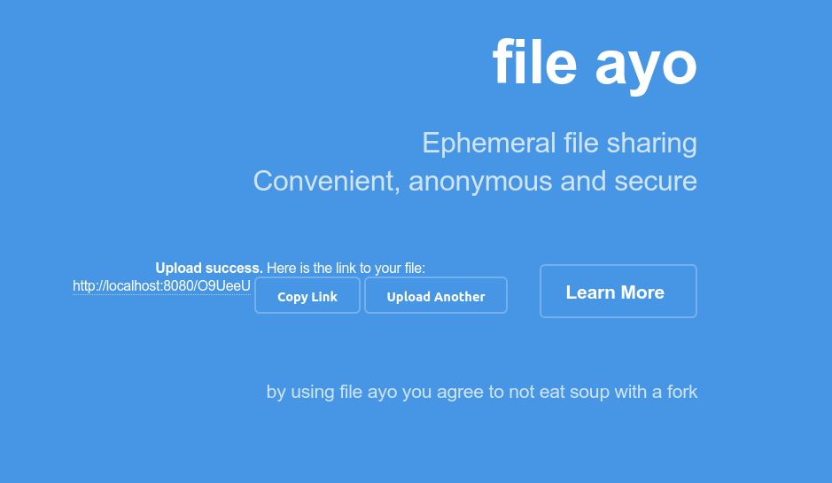

# Fileio

[File.io](https://file.io) clone in Go, Simply upload a file, share the link, and after it is downloaded, the file is completely deleted. For added security, set an expiration on the file and it is deleted within a certain amount of time, even if it was never downloaded. Watch deployment & usage demo [here](https://youtu.be/KJWKk3j9FuM)



## Installation

By default, ~~this project rely on [Redis](https://redis.io/download) as primary database~~, and the default app port are 8080

### Docker

Using [file.io-clone](https://hub.docker.com/r/codenoid/file.io-clone) docker image is the fastest way to try file.io clone if you already have docker installed 

```sh
$ docker pull codenoid/file.io-clone
$ docker run --env DATABASE=redis://host.docker.internal:6379/0 -p 3003:8080 codenoid/file.io-clone
  # host.docker.internal currently only works in Windows & Mac, open *:3003 on your browser
  # for badger database, --env DATABASE=badger:/path/to/folder
```

### Building From Source

before this, make sure [Go](https://golang.org/dl/) already installed on your machine

```sh
$ git clone https://github.com/codenoid/file.io.git && cd file.io
$ go get github.com/GeertJohan/go.rice/rice
$ rice embed-go
$ go build -trimpath
$ ./fileio # open localhost:8080 on your browser
```

### Configuring

Simply, you just need to set `DATABASE` env : 

```sh
# for redis
DATABASE=redis://127.0.0.1:6379/0
# for badger, you need to specify existing or new badger working directory, if the directory is empty
# badger will automatically create the directory and write the data into it
DATABASE=badger:/full/path/to/folder
```

## Example Usage

### Using CURL

```sh
# upload
$ curl -F "file=@filename.jpg" http://localhost:8080/?exp=60s
{"expiry":"1m0s","key":"eA9666","link":"http://localhost:8080/eA9666","sec_exp": 60,"success":true}
# download
$ wget --content-disposition http://localhost:8080/eA9666
# xxxx-file-name downloaded, use chmod if it was binary
$ wget http://localhost:8080/eA9666
# 404 not found

# max file download times
$ curl -F "file=@filename.jpg" http://localhost:8080/?exp=60s&max=2
{"expiry":"1m0s","key":"eA9666","link":"http://localhost:8080/eA9OeA","sec_exp": 60,"success":true}
$ wget --content-disposition http://localhost:8080/eA9OeA
# downloaded
$ wget --content-disposition http://localhost:8080/eA9OeA
# downloaded
$ wget --content-disposition http://localhost:8080/eA9OeA
# 404 not found
```

## Features & TODO

- [x] Custom expiration option
- [x] Content-Disposition header
- [x] Multiple Storage Support
- [x] Max download option/times
- [x] Simple API

# Legal

This code is in no way affiliated with, authorized, maintained, sponsored or endorsed by [https://www.file.io](https://file.io) or any of its affiliates or subsidiaries. This is an independent and unofficial software. Use at your own risk.
